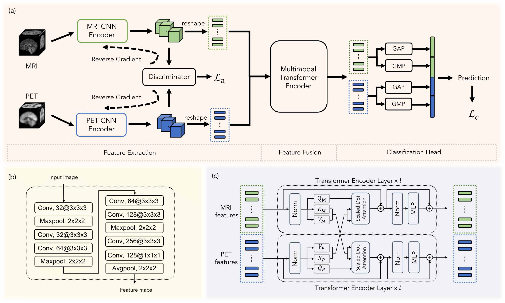

# Transformer-based Multimodal Fusion for Early Diagnosis of Alzheimer’s Disease Using Structural MRI and PET

This repo contains PyTorch implementation of the paper: Transformer-based Multimodal Fusion for Early Diagnosis of Alzheimer’s Disease Using Structural MRI and PET. 

[Paper Link](https://ieeexplore.ieee.org/abstract/document/10230577/)



## Setup Instructions

### Datasets

Directory structure

   ````
   ├── MRI                            # MRI images
   │    ├── sub-ADNI001S0001.nii.gz
   │    ├── sub-ADNI009S0001.nii.gz   
   │    ├── ...
   ├── PET                            # PET images
   │    ├── sub-ADNI001S0001.nii.gz
   │    ├── sub-ADNI009S0001.nii.gz
   │    ├── ...
   ├── ADNI.csv                       # label file 
   ````

Label file

````
| Subject          | Group | Age | ...
————————————————————————————————————————
| sub-ADNI001S0001 | AD    | xx  | ...
| sub-ADNI009S0001 | CN    | xx  | ...
| sub-ADNI002S0001 | pMCI  | xx  | ...
| sub-ADNI003S0001 | sMCI  | xx  | ...
| ...              | ...   | ..  | ...
````

### Dependancies

``pip install -r ./requirements.txt``

## Run the Model

``python kfold_train_adversarial.py --randint False --aug True --batch_size 8 --name <expr_name> --task <ADCN/pMCIsMCI> --model <CNN/Transformer> --dataroot <data_dir>
``

## References

If you think our research work helpful, please consider citing our original paper.

````
@inproceedings{zhang2023transformer,
  title={Transformer-Based Multimodal Fusion for Early Diagnosis of Alzheimer's Disease Using Structural MRI And PET},
  author={Zhang, Yuanwang and Sun, Kaicong and Liu, Yuxiao and Shen, Dinggang},
  booktitle={2023 IEEE 20th International Symposium on Biomedical Imaging (ISBI)},
  pages={1--5},
  year={2023},
  organization={IEEE}
}
````
